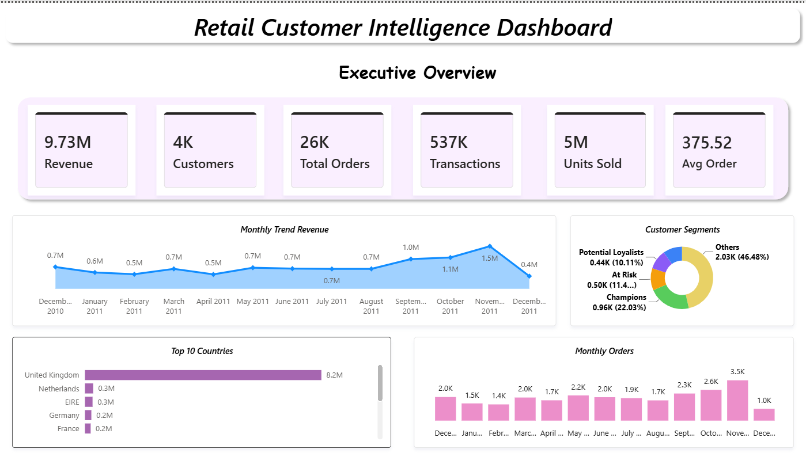
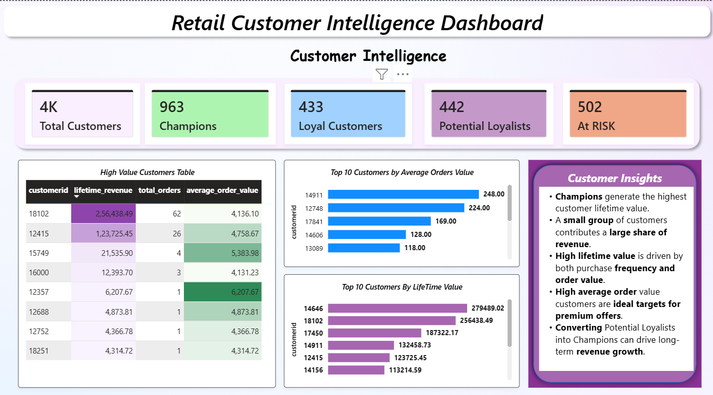
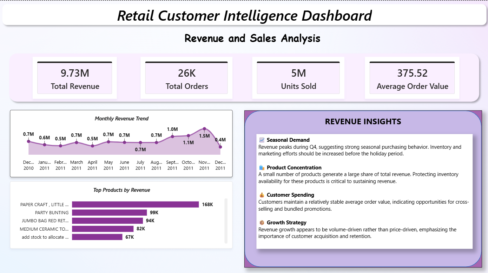
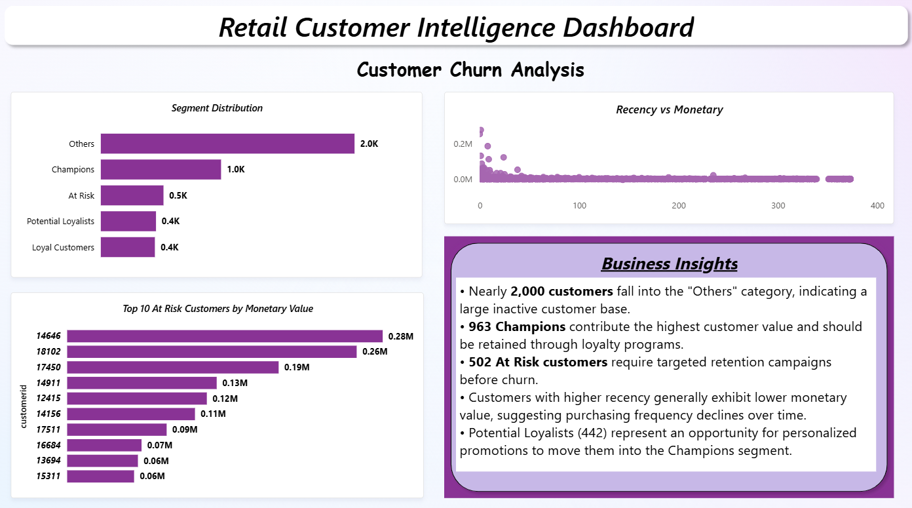
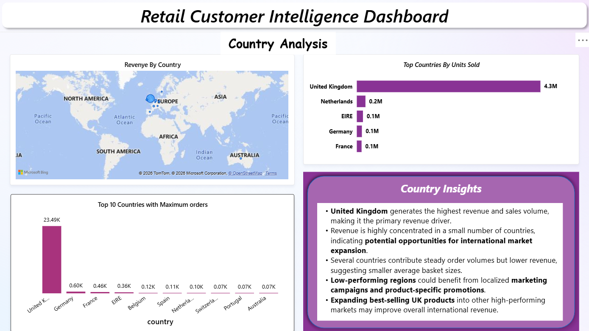

# 📊 Retail Customer Intelligence Dashboard

An end-to-end Business Intelligence project that transforms raw retail transactions into actionable business insights using **SQL** and **Power BI**.

The project focuses on customer behavior, revenue trends, RFM segmentation, churn analysis, and country-wise sales performance to support strategic business decisions.

---

# 🚀 Project Overview

This dashboard helps answer key business questions such as:

- Who are the highest-value customers?
- Which customers are likely to churn?
- Which products generate the highest revenue?
- Which countries contribute the most sales?
- How does revenue change over time?
- Which customer segments should be targeted for retention?

---

# 🛠 Tech Stack

- PostgreSQL
- SQL
- Power BI
- DAX
- Star Schema Data Warehouse
- Microsoft Bing Maps

---

# 📂 Project Structure

```
Retail_Customer_Intelligence_Dashboard
│
├── PowerBI
│   └── Retail_Customer_Intelligence_Dashboard.pbix
│
├── SQL
│   ├── Dimension Creation
│   ├── Fact Table
│   ├── Revenue Analysis
│   ├── RFM Segmentation
│   ├── Customer Analysis
│   └── Product Analysis
│
├── Images
│
├── Reports
│
├── Docs
│
└── README.md
```

---

# 📈 Dashboard Pages

## 1️⃣ Executive Overview

Provides a high-level summary of the business.

### KPIs

- Revenue
- Customers
- Orders
- Transactions
- Units Sold
- Average Order Value

### Visuals

- Monthly Revenue Trend
- Customer Segments
- Top Countries
- Monthly Orders



---

## 2️⃣ Customer Intelligence

Analyzes customer value and purchasing behavior.

### Highlights

- Champions
- Loyal Customers
- Potential Loyalists
- At Risk Customers

### Visuals

- High Value Customer Table
- Top Customers by Orders
- Top Customers by Lifetime Value
- Customer Insights



---

## 3️⃣ Revenue & Sales Analysis

Provides insights into revenue performance.

### Visuals

- Monthly Revenue Trend
- Top Products by Revenue
- Revenue Insights



---

## 4️⃣ Customer Churn Analysis

Identifies customer churn risks using RFM segmentation.

### Visuals

- Segment Distribution
- Recency vs Monetary Scatter Plot
- Top At-Risk Customers
- Business Insights



---

## 5️⃣ Country Analysis

Analyzes geographical sales performance.

### Visuals

- Revenue by Country
- Units Sold by Country
- Orders by Country
- Country Insights



---

# ⭐ Key Business Insights

### Customer Intelligence

- Champions generate the highest customer lifetime value.
- A small customer group contributes a significant share of revenue.
- High-value customers deserve retention-focused strategies.
- Potential Loyalists represent strong upselling opportunities.

---

### Revenue Analysis

- Revenue peaks during Q4, indicating seasonal demand.
- A small number of products contribute most revenue.
- Stable average order values indicate opportunities for cross-selling.
- Revenue growth is largely driven by purchase volume.

---

### Customer Churn

- Around 500 customers are classified as At Risk.
- Higher recency generally corresponds to lower monetary value.
- Loyalty campaigns should prioritize Potential Loyalists.
- Champions should be retained through personalized rewards.

---

### Country Analysis

- The United Kingdom dominates revenue and sales volume.
- Revenue is concentrated in a few countries.
- Lower-performing regions provide opportunities for expansion.
- Localized promotions can improve international sales.

---

# 🗄 Database Design

The project follows a **Star Schema** consisting of:

### Fact Table

- Fact Sales

### Dimension Tables

- Customer
- Product
- Country
- Date

---

# 📊 Features

- Executive Dashboard
- Revenue Analysis
- Customer Intelligence
- Customer Churn Analysis
- Country Analysis
- RFM Segmentation
- Interactive Power BI Dashboard
- SQL Views
- Business Insights

---

# 📌 Future Improvements

- Predictive Customer Churn Model
- Customer Lifetime Value Prediction
- Product Recommendation Engine
- Sales Forecasting using Machine Learning
- Dynamic What-If Analysis

---

# 👨‍💻 Author

**Yasti Kotak**

Computer Science & Business Systems

Dayananda Sagar College of Engineering

Interested in Data Analytics, Business Intelligence and Machine Learning.
